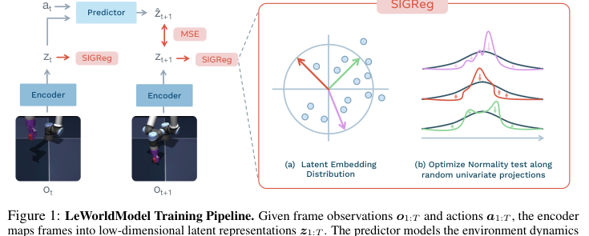
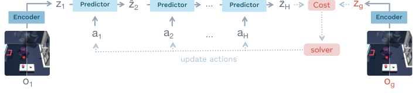
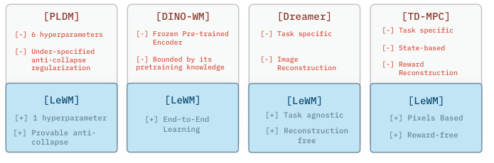
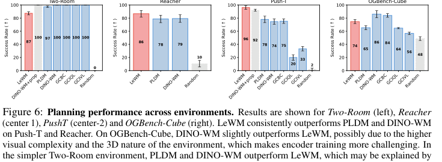
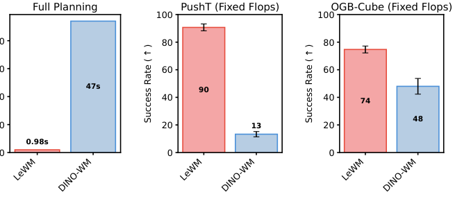
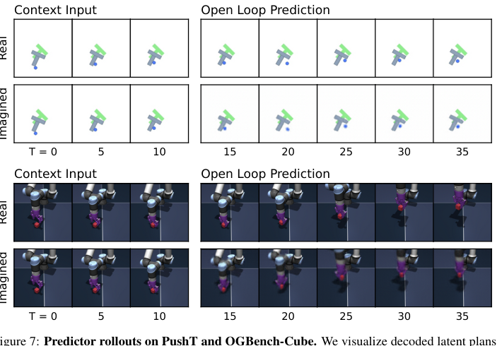
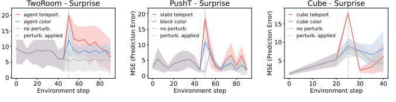

# LeWorldModel: Stable End-to-End Joint-Embedding Predictive Architecture from Pixels

[Back to World Model Index]({{ '/world-model/' | relative_url }})

## Metadata

| Field | Value |
|---|---|
| Year | 2026 |
| Authors | Lucas Maes, Quentin Le Lidec, Damien Scieur, Yann LeCun, Randall Balestriero |
| Venue | arXiv:2603.19312v2 |
| Area | Embodied AI / World Models / JEPA |
| Paper | https://arxiv.org/abs/2603.19312v2 |
| Code | https://github.com/lucas-maes/le-wm |
| Project | https://le-wm.github.io |

## One-Sentence Summary

LeWM 是一个从像素端到端训练的 JEPA latent world model，用 next-embedding prediction 加 SIGReg 高斯分布正则稳定学习 action-conditioned dynamics，并在 latent space 中用 CEM/MPC 做快速规划。

## Core Idea

LeWM 的核心是把 JEPA 的 anti-collapse 问题变成 latent distribution matching：预测损失让模型学习可预测的环境动态，SIGReg 让 latent embeddings 在随机一维投影上匹配标准高斯，从而避免所有输入映射到常数向量。



## Architecture And Data Flow

### Key Figures

| Figure | File | Role |
|---|---|---|
| Figure 1 | `./figures/fig1_training_pipeline.png` | Training pipeline and SIGReg anti-collapse |
| Figure 2 | `./figures/fig2_latent_world_model_characteristics.png` | Comparison with PLDM, DINO-WM, Dreamer, and TD-MPC |
| Figure 4 | `./figures/fig4_latent_planning.png` | Latent planning and MPC data flow |
| Figure 6 | `./figures/fig6_planning_performance.png` | Planning performance across environments |
| Figure 7 | `./figures/fig7_predictor_rollouts.png` | Open-loop latent rollout visualization |
| Figure 10 | `./figures/fig10_violation_expectation_lewm.png` | Violation-of-expectation surprise |

### Figure 1: Training Pipeline


该图展示 LeWM 的训练流程：连续帧 `o_t, o_{t+1}` 分别经过同一个 encoder 得到 `z_t, z_{t+1}`，predictor 以 `z_t` 和动作 `a_t` 为条件预测 `hat z_{t+1}`，通过 MSE 拉近 `hat z_{t+1}` 与真实下一帧 embedding `z_{t+1}`；同时对 latent embedding 应用 SIGReg，使其投影到多个随机方向后匹配一维标准高斯分布。

| Module | Input | Output | Role |
|---|---|---|---|
| Encoder | RGB frame `o_t` | latent `z_t` | 从像素中提取紧凑动态表征 |
| Predictor | latent `z_t`, action `a_t` | predicted latent `hat z_{t+1}` | 建模 action-conditioned dynamics |
| Prediction loss | `hat z_{t+1}`, `z_{t+1}` | scalar loss | 学习下一步 latent 预测 |
| SIGReg | batch/time latent embeddings | scalar regularizer | 防止 latent collapse，鼓励各向同性高斯分布 |

训练阶段的数据流：

```text
offline pixel trajectory o_1:T + action trajectory a_1:T
-> encoder(o_t) = z_t
-> predictor(z_t, a_t) = hat z_{t+1}
-> prediction loss: ||hat z_{t+1} - z_{t+1}||^2
-> SIGReg(z_1:T)
-> update encoder + predictor end-to-end
```

关键理解：LeWM 的重点不是新增复杂预测器，而是把 JEPA 的 anti-collapse 问题转化为 latent distribution matching。SIGReg 给 latent space 一个可优化、可解释的非坍缩约束，因此不需要 stop-gradient、EMA target encoder、冻结预训练视觉模型或像素重建损失。

### Figure 4: Latent Planning



该图展示测试时如何用 learned latent dynamics 做规划。初始观测 `o_1` 和目标观测 `o_g` 分别编码为 `z_1` 和 `z_g`；给定候选动作序列，predictor 自回归 rollout 到 horizon `H`，得到 `hat z_H`；优化器根据 `hat z_H` 与 `z_g` 的 latent distance 更新动作序列。

| Module | Input | Output | Role |
|---|---|---|---|
| Encoder | current image `o_1`, goal image `o_g` | `z_1`, `z_g` | 把 goal-conditioned control 映射到 latent space |
| Predictor rollout | `z_1`, `a_{1:H}` | `hat z_{2:H}` | 预测候选动作序列导致的未来 latent |
| Cost | `hat z_H`, `z_g` | terminal cost | 衡量候选计划是否接近目标 |
| CEM solver | action sequence distribution, costs | updated action distribution | 采样、筛选 elite、更新动作分布 |
| MPC loop | new observation | new plan | 执行动作后重新观测并重规划 |

推理阶段的数据流：

```text
current observation o_1, goal observation o_g
-> z_1 = encoder(o_1), z_g = encoder(o_g)
-> sample action sequences with CEM
-> rollout latent dynamics to horizon H
-> minimize terminal cost ||hat z_H - z_g||^2
-> execute planned actions under MPC
-> observe new frame and replan
```

训练不需要目标图像和规划器，只需要离线 `(observation, action)` 轨迹。推理时模型参数固定，优化的是动作序列，而不是 encoder/predictor。

### Overall Architecture



LeWM 由两个主要网络组成：

- Encoder：ViT-Tiny，patch size 14，12 层、3 heads、hidden dim 192，约 5M 参数。取最后层 `[CLS]` token，并接 1-layer MLP + BatchNorm 投影。
- Predictor：Transformer，6 层、16 heads、10% dropout，约 10M 参数。动作通过 AdaLN 注入每层，AdaLN 参数零初始化以稳定训练。

总参数量约 15M。论文强调该规模可以在单张 GPU 上训练数小时。

| Component | Input | Output | Purpose |
|---|---|---|---|
| ViT encoder | `224 x 224` RGB frame | `D=192` latent | 像素到低维动态表征 |
| Projection head | `[CLS]` token | projected latent | 避免 LayerNorm 影响 SIGReg 优化 |
| Predictor transformer | history latent, action blocks | next latent | 建模 latent dynamics |
| AdaLN action conditioning | continuous action | layer-wise affine conditioning | 让动作逐层影响预测器 |
| SIGReg | `N x B x d` embedding tensor | regularization loss | 防止 collapse |
| CEM planner | action sequences | optimized plan | 测试时做 goal-conditioned planning |

## Core Functions And Objectives

### 1. Encoder And Predictor

\[
z_t = \operatorname{enc}_{\theta}(o_t), \qquad
\hat{z}_{t+1} = \operatorname{pred}_{\phi}(z_t, a_t)
\]

这定义了 LeWM 的基本动态预测形式：先从像素得到 latent，再用动作条件预测未来 latent。训练时它用于 prediction loss；推理时它用于 planning rollout。模型学习的是“当前 latent 状态执行动作后会到达哪个 latent 状态”，而不是生成下一帧像素。

| Symbol | Meaning |
|---|---|
| `o_t` | 时刻 `t` 的 RGB 观测 |
| `a_t` | 时刻 `t` 的动作 |
| `z_t` | encoder 产生的 latent embedding |
| `hat z_{t+1}` | predictor 预测的下一步 latent |
| `theta`, `phi` | encoder 与 predictor 参数 |

### 2. Prediction Loss

\[
L_{\mathrm{pred}} = \left\lVert \hat{z}_{t+1} - z_{t+1} \right\rVert_2^2
\]

该损失让 predictor 学习 latent dynamics，同时推动 encoder 形成对未来可预测的表征。单独使用这个目标有 collapse 风险：encoder 可以把所有输入映射为常数向量，使预测损失变小但表征失去信息。

### 3. SIGReg Anti-Collapse Regularization

\[
\operatorname{SIGReg}(Z)
= \frac{1}{M}\sum_{m=1}^{M} T\!\left(h^{(m)}\right),
\qquad
h^{(m)} = Z u^{(m)}, \quad u^{(m)} \in \mathbb{S}^{d-1}
\]

SIGReg 通过随机投影把高维 latent distribution matching 转化为多个一维正态性匹配。根据 Cramer-Wold 定理，如果所有一维投影都匹配，联合分布也会被约束。直观上，它要求 latent cloud 在随机方向上都像标准高斯，从而避免坍缩到单点或低维子空间。

| Symbol | Meaning |
|---|---|
| `Z` | latent embedding tensor，包含 history length、batch、dimension |
| `M` | 随机投影方向数量，论文默认 1024 |
| `u^{(m)}` | 第 `m` 个单位球面随机方向 |
| `h^{(m)}` | embedding 在该方向上的一维投影 |
| `T` | Epps-Pulley 一维正态性检验统计量 |

### 4. Total Training Objective

\[
L_{\mathrm{LeWM}}
= L_{\mathrm{pred}} + \lambda \operatorname{SIGReg}(Z)
\]

总目标在“可预测性”和“非坍缩分布”之间建立平衡。`L_pred` 学习动作条件动态，`SIGReg` 约束 embedding 分布，`lambda` 控制正则强度，论文默认值为 0.1。

### 5. Latent Planning Cost

\[
C(\hat{z}_H) = \left\lVert \hat{z}_H - z_g \right\rVert_2^2,
\qquad
z_g = \operatorname{enc}_{\theta}(o_g)
\]

推理时，目标图像 `o_g` 被编码为目标 latent `z_g`。候选动作序列 rollout 到 horizon 末端得到 `hat z_H`，规划器最小化二者距离。这个设计把 goal-reaching 转成 latent space 的终端距离最小化。

### 6. Finite-Horizon Action Optimization

\[
a^{*}_{1:H} = \arg\min_{a_{1:H}} C(\hat{z}_H)
\]

论文使用 CEM 求解这个动作优化问题：采样大量动作序列，rollout 计算 cost，选 cost 最低的 elite action sequences，再更新采样分布。这里 world model 固定不动，优化的是动作序列。

### 7. Implementation Sketch

```python
def LeWorldModel(obs, actions, lambd=0.1):
    emb = encoder(obs)                 # (B, T, D)
    next_emb = predictor(emb, actions) # (B, T, D)

    pred_loss = mse(emb[:, 1:], next_emb[:, :-1])
    sigreg_loss = mean(SIGReg(emb.transpose(0, 1)))

    return pred_loss + lambd * sigreg_loss
```

这段伪代码对应论文的核心训练逻辑：encoder 和 predictor 端到端更新；监督信号来自下一步 latent prediction 和 SIGReg，而不是奖励、像素重建或冻结视觉特征。

## Main Results



- LeWM 在 PushT 和 Reacher 上优于 PLDM 和 DINO-WM。
- 在 OGBench-Cube 上，DINO-WM 略优，论文认为 3D 视觉复杂度使端到端 encoder 训练更难。
- 在 TwoRoom 上，LeWM 弱于 PLDM/DINO-WM，可能因为低内在维环境与高维高斯 SIGReg 先验不匹配。
- LeWM full planning 约 0.98s，而 DINO-WM 约 47s，规划速度提升约 48x。



## Physical Understanding

LeWM 通过 probing、decoder visualization、t-SNE 和 violation-of-expectation 评估 latent 是否捕捉物理结构。





## Key Limitations

- 仍依赖动作标签和覆盖充分的离线轨迹。
- 规划 horizon 较短，autoregressive latent rollout 会累积误差。
- 真实机器人、多视角、长时序任务尚未验证。
- goal-image cost 表达能力有限，不一定覆盖复杂语言任务或约束任务。

## Why It Matters

LeWM 说明端到端像素 world model 不一定需要冻结基础视觉模型或复杂多项正则。对机器人和具身智能研究，它提供了一个轻量、reward-free、可规划的 latent dynamics 路线。
