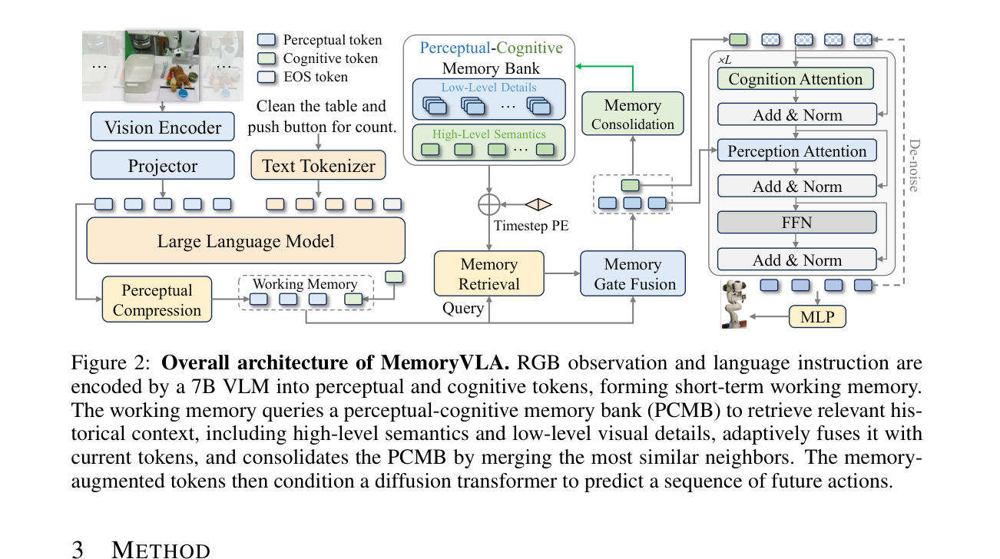
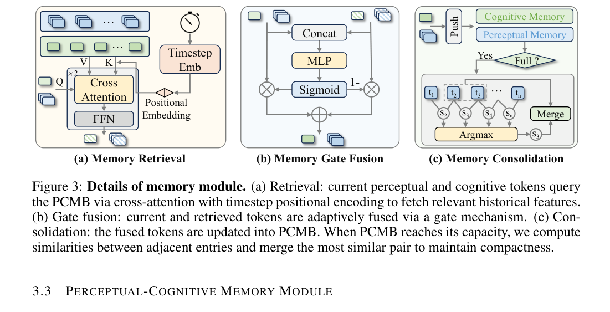
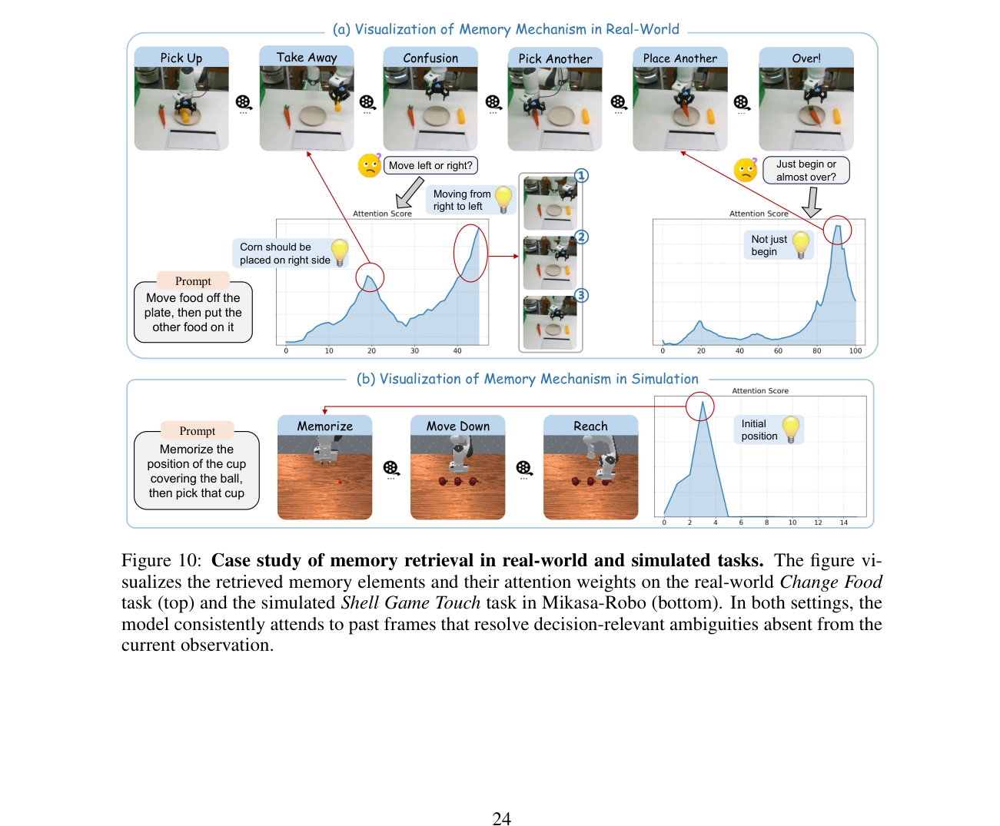
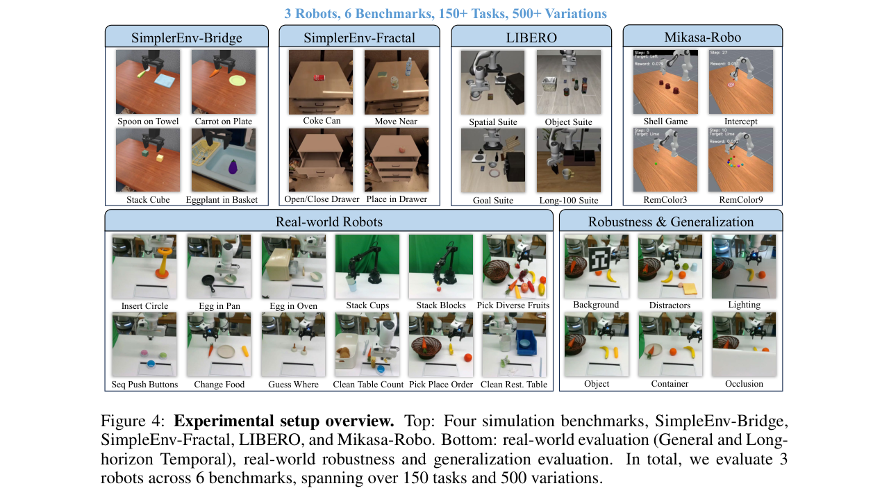
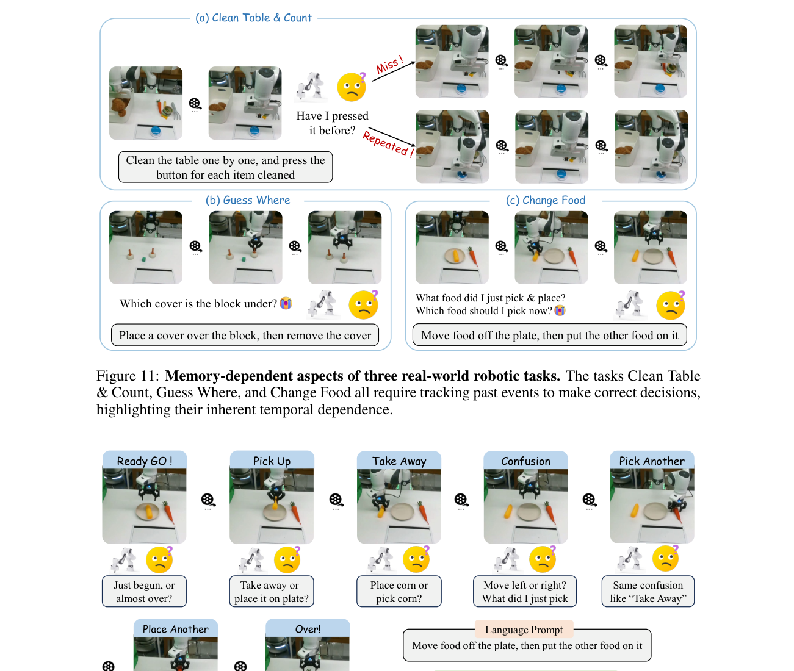
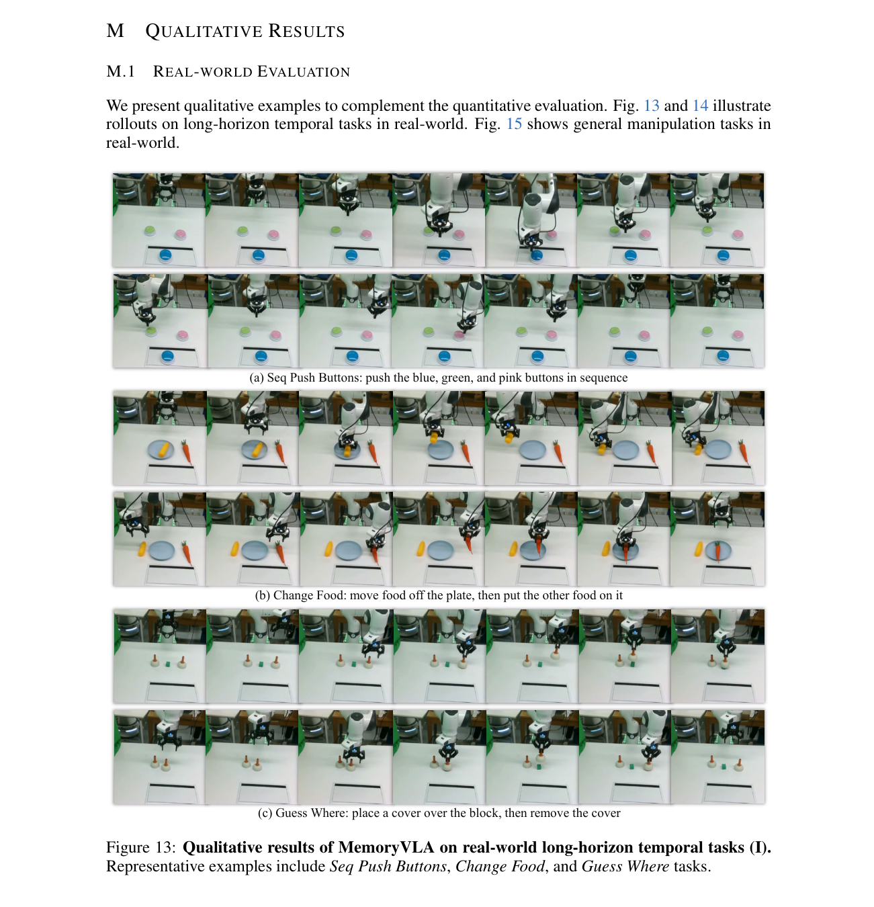
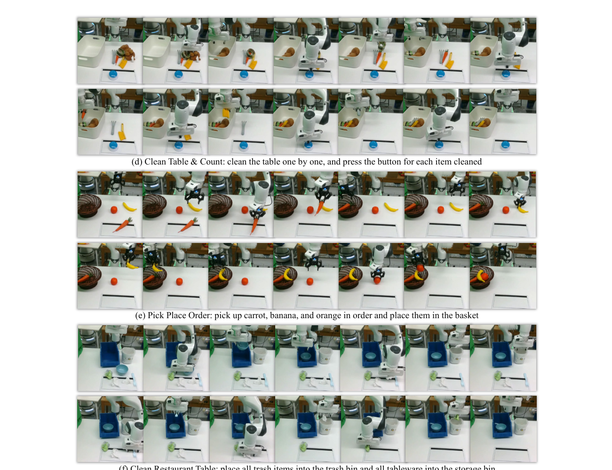

# MemoryVLA：面向机器人操作的感知-认知记忆 VLA

[返回 VLA 论文索引]({{ '/vla/' | relative_url }})

## 基本信息

| 字段 | 内容 |
|---|---|
| 论文 | MemoryVLA: Perceptual-Cognitive Memory in Vision-Language-Action Models for Robotic Manipulation |
| 会议 | ICLR 2026 |
| arXiv | 2508.19236v2 |
| 作者 | Hao Shi, Bin Xie, Yingfei Liu, Lin Sun, Fengrong Liu, Tiancai Wang, Erjin Zhou, Haoqiang Fan, Xiangyu Zhang, Gao Huang |
| 机构 | Tsinghua University, Dexmal, MEGVII, Tianjin University, HIT, StepFun |
| 项目页 | https://shihao1895.github.io/MemoryVLA |
| 代码 | https://github.com/shihao1895/MemoryVLA |
| 方向 | VLA、长时序机器人操作、具身记忆、扩散动作策略 |

## 一句话总结

MemoryVLA 给 VLA policy 加入感知-认知双流记忆库，使机器人能在当前视觉状态不充分时检索历史视觉细节和语义上下文，再用扩散动作专家生成连续动作序列。

## 核心思想

许多机器人操作任务不是马尔可夫决策问题。当前图像可能无法告诉模型按钮是否已经按过、隐藏物体原先在哪个杯子下、当前子目标是否已经完成，或者刚刚移动过哪个对象。MemoryVLA 的关键判断是：VLA 的状态不能只由当前图像和语言指令决定，还应该包含 episode 内可读写的历史记忆。

具体做法是：

1. 当前 RGB 图像和语言指令经过 VLM 编码，形成 perceptual tokens 与 cognitive token。
2. 这两类 token 组成 working memory。
3. working memory 查询 Perceptual-Cognitive Memory Bank，检索历史低层视觉细节和高层语义摘要。
4. 检索结果通过 learned gate 与当前 token 融合。
5. 融合后的 token 一方面更新 memory bank，另一方面条件化 diffusion action expert。
6. 动作专家输出未来 16 步连续 7-DoF action chunk。

这篇论文最重要的贡献不是单独提出一个动作头，而是把“历史应该如何被 VLA 保存、检索、融合和压缩”变成了模型结构的一部分。

## 架构与数据流

### 关键图

| 图 | 路径 | 说明 |
|---|---|---|
| Figure 1 | `./figures/fig1_overview.png` | 问题动机、人类双记忆类比、MemoryVLA 总览和主要结果 |
| Figure 2 | `./figures/fig2_architecture_cropped.png` | MemoryVLA 总体架构 |
| Figure 3 | `./figures/fig3_memory_module.png` | 记忆检索、门控融合和记忆压缩 |
| Figure 4 | `./figures/fig4_experiment_setup.png` | 仿真、真实机器人和 OOD 评估设置 |
| Figure 10 | `./figures/fig10_memory_retrieval_case_full.png` | 模型在记忆依赖任务中实际检索到的历史片段 |

### Figure 2：总体架构



MemoryVLA 从单张第三人称 RGB 图像和语言指令开始。视觉端使用 DINOv2 与 SigLIP 提取 raw visual tokens；perceptual compression module 将其压缩成细粒度 perceptual tokens；另一支路将视觉 token 投影到语言嵌入空间，与指令 token 一起送入 7B Prismatic VLM / LLaMA，取 EOS 位置输出作为 cognitive token。perceptual tokens 与 cognitive token 共同构成 working memory，并用于查询 PCMB。

| 模块 | 输入 | 输出 | 作用 |
|---|---|---|---|
| Vision encoder | RGB 图像 | raw visual tokens | 提取当前视觉特征 |
| Perceptual compression | raw visual tokens | 256 个 perceptual tokens | 保留低层视觉细节，同时压缩 token 数 |
| Projector + LLM | visual tokens + language instruction | EOS cognitive token | 产生高层语义状态 |
| Working memory | 当前 perceptual/cognitive tokens | query tokens | 表示当前短时决策上下文 |
| PCMB | 历史 perceptual/cognitive entries | retrieved history | 保存 episode 内长期历史 |
| Memory retrieval | working memory + PCMB | retrieved embeddings | 检索当前决策相关的历史 |
| Gate fusion | 当前 token + 检索 token | memory-augmented tokens | 自适应融合当前观测和历史记忆 |
| Consolidation | 新融合 token + PCMB | 更新后的 PCMB | 合并相邻冗余记忆，控制容量 |
| Diffusion action expert | noisy action tokens + fused memory tokens | denoised action chunk | 生成连续 7-DoF 动作 |

训练阶段数据流：

```text
按时间排序的 episode frames
-> 当前 RGB I_t + 指令 L
-> 生成 perceptual tokens p_t 和 cognitive token c_t
-> 带 timestep positional encoding 查询 PCMB
-> 检索历史 perceptual / cognitive context
-> gate fusion 得到 memory-augmented tokens
-> append 到 PCMB；容量满时合并相邻相似 token
-> diffusion action expert 预测 16-step action chunk
-> 与 demonstration actions 做 MSE 监督
```

推理阶段数据流：

```text
当前 RGB + 语言指令
-> 编码当前 perceptual / cognitive tokens
-> 从 PCMB 检索 episode 历史
-> 融合当前信息和历史信息
-> DDIM 10 步去噪，CFG scale = 1.5
-> 输出未来 16 步 7-DoF actions
-> 机器人执行动作，并带着更新后的 memory 进入下一轮闭环
```

关键理解：PCMB 不是静态数据库，而是 episode 内持续读写的 policy state。它让模型能区分“当前图像相似但历史不同”的状态，这是长时序操作中单帧 VLA 最容易失败的地方。

### Figure 3：记忆模块



| 组件 | 输入 | 输出 | 作用 |
|---|---|---|---|
| Retrieval | 当前 p/c tokens、memory key/value、timestep PE | `H^p`, `H^c` | 用 cross-attention 检索相关历史 |
| Gate fusion | 当前 token `x`、检索 token `H^x` | `x_tilde` | 学习当前信息和历史信息的融合比例 |
| Consolidation | fused tokens、PCMB 容量 | compacted PCMB | 合并相邻且相似的记忆条目 |

Retrieval 使用带时间编码的 cross-attention。时间编码很关键，因为同一视觉状态在不同任务阶段可能有不同含义。Gate fusion 避免把历史硬塞进当前表示：如果当前帧足够明确，gate 可以保留当前 token；如果当前帧有遮挡或阶段歧义，gate 可以更多依赖历史。Consolidation 通过合并相邻高相似条目控制 memory 长度，避免 memory bank 无限增长。

### Figure 10：记忆检索案例



这个案例展示了 MemoryVLA 检索的不是普通最近帧，而是能解决当前决策歧义的历史帧。在 Change Food 中，当前图像无法说明刚刚被移走的是哪个食物，模型会关注近期运动趋势和关键分歧帧。在 Shell Game Touch 中，正确杯子取决于之前短暂显露的球的位置，模型 attention peak 出现在那段揭示位置的历史帧上。这支持了论文的核心论点：PCMB 存的是对决策有用的时间线索，而不只是冗余视觉缓存。

## 核心函数与目标

### 1. VLA 策略函数

$$
A = (a_1, \ldots, a_T) = \pi(I, L)
$$

| 符号 | 含义 |
|---|---|
| \(I\) | 当前 RGB 观测 |
| \(L\) | 语言指令 |
| \(A\) | 未来动作序列 |
| \(a_t\) | 第 \(t\) 个 7-DoF 动作，包含相对平移、欧拉角旋转和夹爪状态 |
| \(\pi\) | VLA policy |

这是基础 VLA 映射。MemoryVLA 的变化在于 \(\pi\) 的内部前向过程不再只依赖当前 \(I, L\)，而是同时依赖可更新的 episode memory。

### 2. Working Memory

$$
M_{wk} = \{p \in \mathbb{R}^{N_p \times d_p}, c \in \mathbb{R}^{1 \times d_c}\}
$$

| 符号 | 含义 |
|---|---|
| \(p\) | perceptual tokens |
| \(c\) | cognitive token |
| \(N_p\) | perceptual token 数量，论文中为 256 |
| \(d_p, d_c\) | token 维度 |

Working memory 表示当前短时状态。它同时包含低层视觉细节和高层语义摘要，分别对应“看到了什么”和“当前任务语义是什么”。

### 3. Perceptual-Cognitive Memory Bank

$$
M_{pcmb} = \{m^x \mid x \in \{per, cog\}\}
$$

$$
m^x = \{m_i^x \in \mathbb{R}^{N_x \times d_x}\}_{i=1}^{L}, \quad x \in \{per, cog\}
$$

| 符号 | 含义 |
|---|---|
| \(M_{pcmb}\) | 双流长期记忆库 |
| \(m^{per}\) | perceptual memory stream |
| \(m^{cog}\) | cognitive memory stream |
| \(L\) | 最大 memory length |
| \(m_i^x\) | 第 \(i\) 个历史 memory entry |

PCMB 把低层 perceptual details 和高层 semantic gist 分开保存。这是它区别于简单多帧拼接、LSTM 压缩或历史轨迹绘制方法的核心结构。

### 4. Memory Retrieval

$$
K^x = [m_1^x + TE(t_1); \ldots; m_L^x + TE(t_L)], \quad
V^x = [m_1^x; \ldots; m_L^x]
$$

$$
\hat{H}^x = \operatorname{softmax}\left(\frac{q^x(K^x)^\top}{\sqrt{d_x}}\right)V^x,
\quad q^x \in \{p, c\}, \quad x \in \{per, cog\}
$$

| 符号 | 含义 |
|---|---|
| \(q^x\) | 当前 perceptual 或 cognitive query |
| \(K^x\) | 加入 timestep positional encoding 的 memory keys |
| \(V^x\) | memory values |
| \(TE(t_i)\) | 第 \(i\) 个 memory entry 的时间位置编码 |
| \(\hat{H}^x\) | 原始检索结果 |

该函数在训练和推理阶段都会使用。它让当前 working memory 能从历史中取回与当前动作选择有关的信息，例如隐藏物体位置、最近完成的子步骤或已经按过的按钮。

### 5. Gate Fusion

$$
g^x = \sigma(\operatorname{MLP}(\operatorname{concat}[x, H^x]))
$$

$$
\tilde{x} = g^x \odot H^x + (1 - g^x) \odot x
$$

| 符号 | 含义 |
|---|---|
| \(x\) | 当前 token stream，可以是 perceptual 或 cognitive |
| \(H^x\) | 检索到的历史 embedding |
| \(g^x\) | learned gate |
| \(\tilde{x}\) | memory-augmented token |

Gate fusion 的作用是动态决定当前观测和历史记忆谁更重要。对于外观清楚的状态，模型可以更多依赖当前帧；对于当前帧无法判断任务阶段的状态，模型可以更多依赖历史。

### 6. Memory Consolidation

$$
i_x^* = \arg\max_{i=1,\ldots,L-1} \cos(\tilde{x}_i, \tilde{x}_{i+1})
$$

$$
m_{i_x^*}^x \leftarrow \frac{1}{2}(\tilde{x}_{i_x^*} + \tilde{x}_{i_x^*+1}),
\quad x \in \{per, cog\}
$$

| 符号 | 含义 |
|---|---|
| \(i_x^*\) | 最相似相邻 memory pair 的索引 |
| \(\cos\) | 余弦相似度 |
| \(m_{i_x^*}^x\) | 合并后的 memory entry |

Consolidation 用于限制 memory bank 大小。它的核心假设是：相邻且相似的记忆通常是冗余的，可以合并成一个代表性 token。潜在失败模式是：两个相邻状态视觉上相似，但隐含任务状态不同，例如按钮按下前后外观接近，此时过度合并可能损失关键信息。

### 7. 动作监督目标

论文说明 diffusion action expert 使用预测动作与目标动作之间的 MSE loss。可概括为：

$$
\mathcal{L}_{action} = \|\hat{A} - A^\*\|_2^2
$$

| 符号 | 含义 |
|---|---|
| \(\hat{A}\) | 预测的 action sequence |
| \(A^\*\) | demonstration action sequence |
| \(\mathcal{L}_{action}\) | 行为克隆动作损失 |

该目标只用于训练。推理时，动作专家使用 DDIM 多步去噪生成 action chunk，条件输入是 memory-augmented perceptual/cognitive tokens。

### 8. 实现流程草图

```text
for each timestep t in an episode:
    p_t = perceptual_compress(DINOv2_SigLIP(I_t))
    c_t = LLM_EOS(project(I_t), tokenize(L))
    H_p, H_c = retrieve_from_PCMB(p_t, c_t, timestep_PE)
    p_tilde = gate_fuse(p_t, H_p)
    c_tilde = gate_fuse(c_t, H_c)
    PCMB.append(p_tilde, c_tilde)
    if PCMB.is_full():
        PCMB.merge_most_similar_adjacent_entries()
    A_hat = diffusion_action_expert(p_tilde, c_tilde)
    execute_or_supervise(A_hat)
```

## 主要实验结果

| Benchmark | MemoryVLA 结果 | 主要对比 |
|---|---|---|
| SimplerEnv-Bridge | 71.9% | 比 CogACT-Large 高 14.6 |
| SimplerEnv-Fractal | 72.7% | 比 CogACT 高 4.6 |
| LIBERO | 96.5% | 比 CogACT 高 3.3 |
| Mikasa-Robo | 41.2% | 比 π0 高 11.8 |
| Real-world General | 85% | 比 CogACT 高 9 |
| Real-world Temporal | 83% | 比 CogACT 高 26 |



最有说服力的结果来自真实长时序 temporal suite。Seq. Push Buttons、Change Food、Guess Where、Clean Table & Count 等任务都要求模型记住历史进度或隐藏状态。MemoryVLA 在这组任务上相对 CogACT 的提升明显大于一般操作任务，说明收益主要来自时间记忆，而不仅是动作头或模型规模。

## 消融实验

| 设计项 | 结论 |
|---|---|
| Memory type | perceptual-only 和 cognitive-only 都不如双流一起使用 |
| Memory length | SimplerEnv 上 16 最好；真实长时序代表任务中 256 最好 |
| Timestep PE | Bridge 上从 69.8 提升到 71.9 |
| Fusion | gate fusion 优于直接相加 |
| Consolidation | token merge 优于 FIFO |

这些消融说明，MemoryVLA 的提升不是简单来自“多放一些历史 token”，而是来自结构化的历史检索、门控融合和紧凑记忆更新。

## 物理理解与定性分析



论文中的真实任务例子解释了为什么单帧 VLA 会失败。Clean Table & Count 需要知道某个物体清理后计数按钮是否已经按过；Guess Where 需要记住物体被遮挡前的位置；Change Food 中当前桌面状态可能无法说明刚才移走了哪个食物。这些都是视觉上相似但历史不同的状态。





## 主要局限

- PCMB 仍然是隐式 token memory，不是可解释的符号状态追踪器。
- 相邻 token merge 可能合并掉视觉相似但任务语义不同的状态。
- 复现依赖大 VLM 训练、保持 episode 时间顺序的 dataloader、diffusion action expert 和复杂 benchmark 协议。
- 真实任务有价值，但距离开放家庭环境中的长期可靠部署还有差距。
- OOD camera view shift 仍然困难。
- 系统没有显式安全约束、碰撞检测、失败恢复或符号级任务规划。

## 为什么重要

MemoryVLA 把 VLA 的核心问题从“如何根据当前图像生成动作”推进到“策略在行动过程中应该记住什么、检索什么、压缩什么”。对长时序机器人操作来说，这个转变很关键：很多失败不是当前帧感知失败，而是跨时间状态估计失败。MemoryVLA 的价值就在于把这种状态估计以可训练的 memory bank 形式嵌入到 VLA policy 中。
