# π0.5：面向开放世界泛化的 Vision-Language-Action 模型

[返回 VLA 论文索引]({{ '/vla/' | relative_url }})

## 基本信息

| 字段 | 内容 |
|---|---|
| 论文 | π0.5: a Vision-Language-Action Model with Open-World Generalization |
| 年份 | 2025 |
| 机构 | Physical Intelligence |
| 版本 | arXiv:2504.16054v1 |
| 方向 | VLA、移动操作、开放世界泛化、机器人共训练 |
| 论文链接 | https://arxiv.org/abs/2504.16054 |
| 项目页 | https://pi.website/blog/pi05 |

## 一句话总结

π0.5 在 π0 的基础上，把目标移动机器人数据、其他机器人数据、高层语义子任务、人工语言指令和 Web 多模态数据放入同一个 VLA 共训练流程，使机器人能在训练未见过的真实家庭中完成厨房清理、卧室整理、放置物体等长时程移动操作任务。

## 核心判断

这篇论文最值得关注的不是某个单独模块，而是训练配方：它证明 VLA 的开放世界泛化很大程度取决于模型是否同时获得四类能力。

| 能力 | 主要数据来源 | 作用 |
|---|---|---|
| 目标平台动作能力 | MM 移动操作数据 | 让模型适配真实移动双臂机器人 |
| 可迁移操作经验 | ME / CE 跨机器人数据 | 扩大场景、任务和 embodiment 覆盖 |
| 物体与场景语义 | Web caption / VQA / localization 数据 | 支撑 OOD 物体识别和语言跟随 |
| 长任务分解 | HL 子任务标注与 VI 语言示范 | 让模型知道当前下一步该做什么 |

## 方法总览

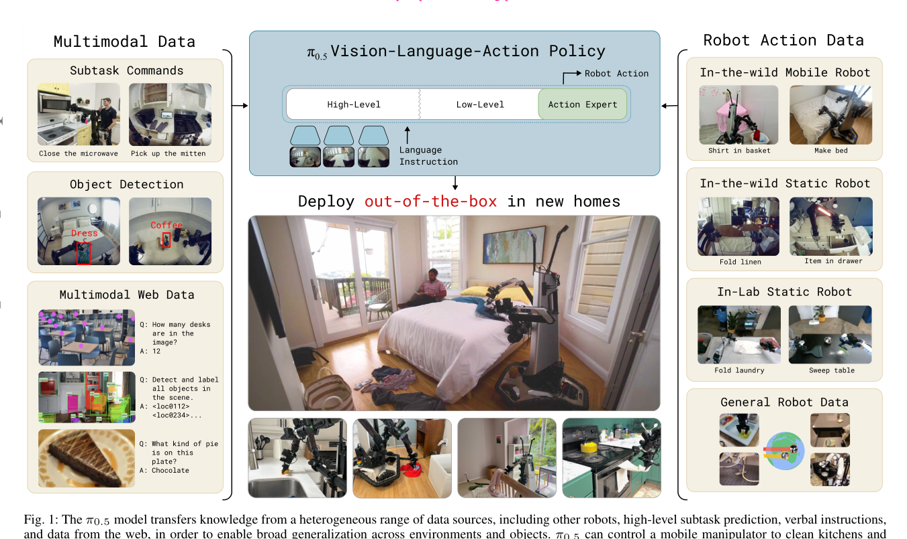

π0.5 的推理可以写成一个层级闭环：

```text
当前多相机观察 + 机器人状态 + 用户总任务
-> 预测当前语义子任务
-> 基于子任务生成连续 action chunk
-> 机器人执行
-> 新观察到来后重新预测
```

这种结构把 `clean the kitchen` 这类抽象任务转成 `pick up plate`、`open drawer`、`put cup in sink` 等可执行子任务。低层动作模型不需要直接理解完整长任务，只需要在当前观察下执行当前子任务。

## 架构与数据流

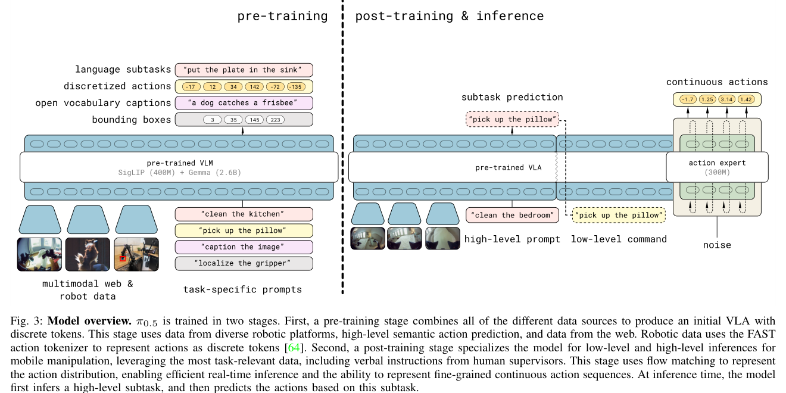

| 模块 | 输入 | 输出 | 作用 |
|---|---|---|---|
| VLM backbone | 图像、语言 prompt、proprioception、离散动作 token | 文本 logits 与共享表征 | 负责场景理解、语言建模、高层子任务预测和 FAST 动作 token 训练 |
| FAST 动作 tokenizer | 机器人 action chunk | 离散 action tokens | 让预训练阶段能用 next-token prediction 高效学习动作 |
| 高层策略 | 当前观察与总任务 | 语义子任务 `l_hat` | 选择当前最合适的下一步行为 |
| action expert | 观察、子任务、噪声动作 chunk、flow timestep | 连续动作向量场 | 用 flow matching 生成低层连续 action chunk |
| 机器人控制器 | action chunk | 手臂、夹爪、底盘、升降机构目标 | 直接执行模型输出，底层只用简单 PD 跟踪 |

训练阶段数据流：

```text
MM / ME / CE 机器人数据
+ HL 高层子任务标注
+ WD Web 多模态任务
-> 离散 token 预训练
-> 加入 VI 语言示范和 flow action expert 后训练
-> 同时保留文本预测能力和连续动作生成能力
```

推理阶段数据流：

```text
observation, q_t, high-level prompt
-> VLM 生成 semantic subtask
-> action expert 条件化在 subtask 上
-> 10 步 flow denoising
-> 连续 action chunk
-> 机器人执行并闭环重规划
```

## 训练数据配方

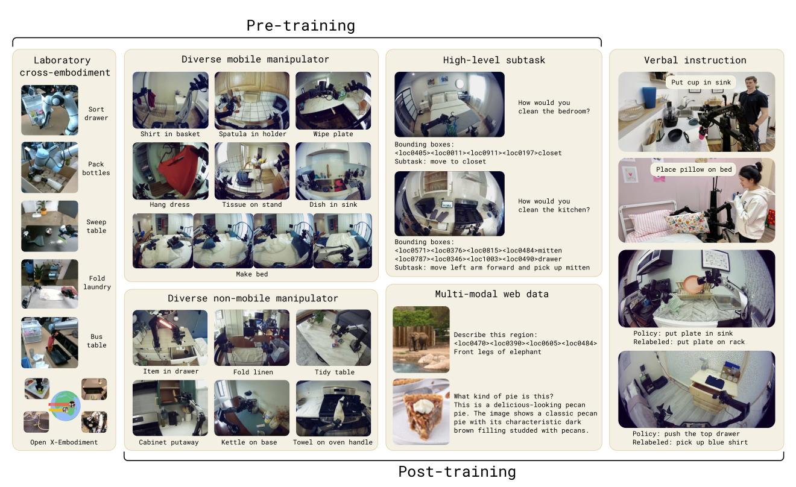

| 数据 | 论文缩写 | 说明 | 主要贡献 |
|---|---|---|---|
| 移动操作数据 | MM | 约 400 小时，约 100 个家庭环境 | 目标 embodiment 和目标任务 grounding |
| 多环境非移动机器人数据 | ME | 固定单臂/双臂，在更多家庭环境采集 | 提供更广泛的家庭场景和操作经验 |
| 跨 embodiment 实验室数据 | CE | 多机器人、多任务，包含 Open X-Embodiment | 提供任务和机器人形态多样性 |
| 高层子任务标注 | HL | 为多阶段轨迹标注当前 semantic subtask 和相关 bbox | 训练高层策略和任务分解能力 |
| Web 多模态数据 | WD | caption、VQA、object localization 等 | 提供物体、场景和 OOD 语义知识 |
| 语言示范 | VI | 人类用语言一步步指导低层策略完成任务 | 提供接近部署分布的高层策略示范 |

论文中的关键事实是：预训练第一阶段大部分样本不是目标移动机器人家庭任务数据，而是来自其他机器人、Web 或语义任务。这说明 π0.5 的泛化能力主要来自异构知识迁移，而不是单纯堆目标机器人数据。

## 核心公式

### 层级策略分解

```text
pi_theta(a_{t:t+H}, l_hat | o_t, l)
= pi_theta(a_{t:t+H} | o_t, l_hat) * pi_theta(l_hat | o_t, l)
```

| 符号 | 含义 |
|---|---|
| `o_t` | 当前观察，包含多相机图像和机器人状态 |
| `l` | 用户给出的总任务 |
| `l_hat` | 模型预测的高层语义子任务 |
| `a_{t:t+H}` | 未来动作 chunk |

直观理解：高层策略负责“现在该做哪一步”，低层策略负责“怎么把这一步做出来”。这降低了低层 action head 直接处理长任务语义的难度。

### 连续动作 flow matching

```text
a_tau = tau * a + (1 - tau) * omega,  omega ~ N(0, I)
```

```text
Loss = CE(text / bbox / FAST action tokens)
     + alpha * || omega - a - f_action(a_tau, o_t, l) ||^2
```

| 项 | 作用 |
|---|---|
| `CE` | 保持文本、bbox、高层子任务和 FAST 动作 token 的离散预测能力 |
| `f_action` | action expert 输出连续动作向量场 |
| `alpha` | 后训练中设为 10.0 |

这个目标让模型先用离散 token 获得训练效率，再用连续 flow matching 获得实时控制质量。

## 注意力结构

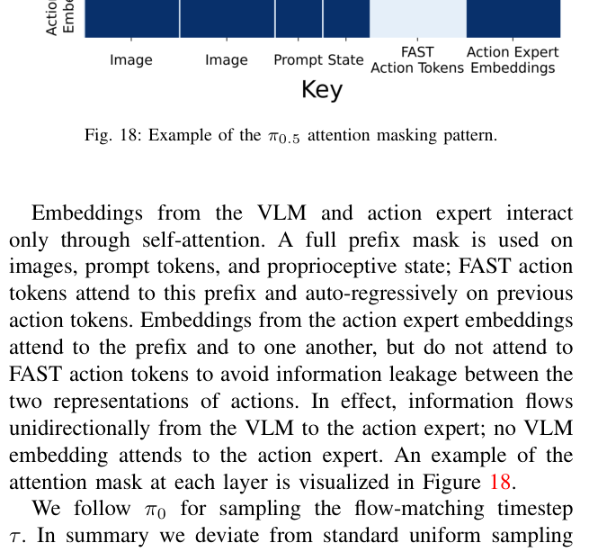

Appendix E 的关键点是：图像、prompt 和 proprioception 构成 prefix；FAST action tokens 只能看 prefix 和历史 FAST tokens；action expert tokens 可以看 prefix 和彼此，但不能看 FAST action tokens。这样可以同时训练离散动作和连续动作，又避免连续动作头在训练时偷看离散动作答案。

## 机器人系统

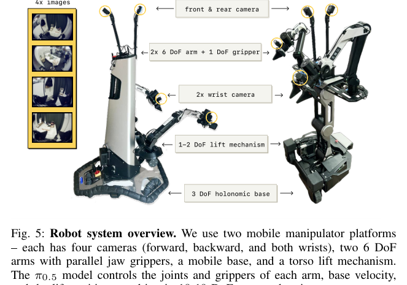

机器人有四个 RGB 摄像头、两条 6-DoF 手臂、平行夹爪、全向底盘和 torso lift。高层推理使用四个摄像头，低层推理使用腕部和前向摄像头。π0.5 直接输出手臂、夹爪、升降机构和底盘速度目标；系统没有额外轨迹规划器或碰撞检测器，因此成功主要来自 VLA 本身，但真实部署安全性和失败恢复仍是限制。

## 实验结论

### 未见家庭泛化

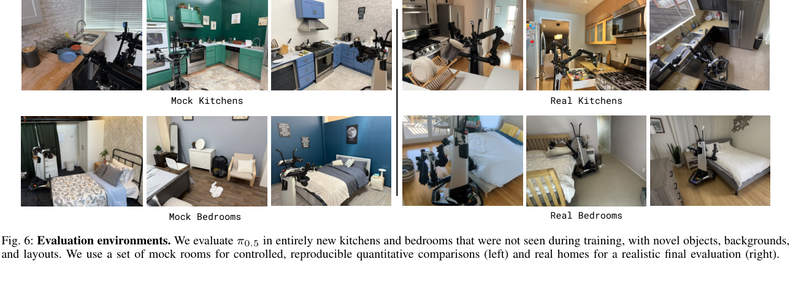

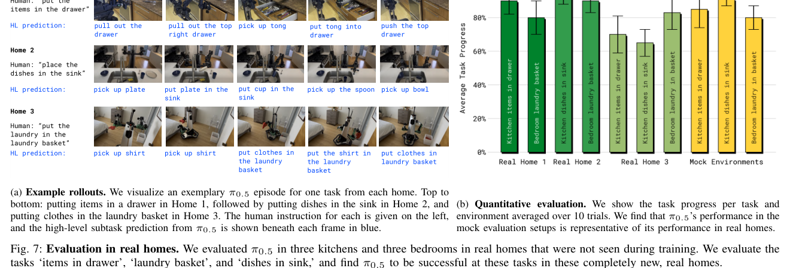

论文在 mock kitchens / bedrooms 和三个真实新厨房、三个真实新卧室中评测。任务包括 `Dishes in Sink`、`Items in Drawer`、`Laundry in Basket` 和 `Make the Bed`。真实家庭结果说明模型可以在训练未见场景中完成多阶段任务，部分复杂任务持续 10 到 15 分钟。

### 环境数量扩展

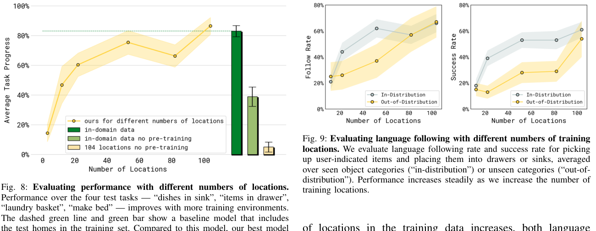

移动操作训练地点从 3、12、22、53、82 扩展到 104 个时，任务平均进度、语言跟随率和成功率整体上升。104-location 模型接近直接包含测试家庭数据的模型，说明完整共训练配方能显著缩小泛化差距。

### 训练配方消融

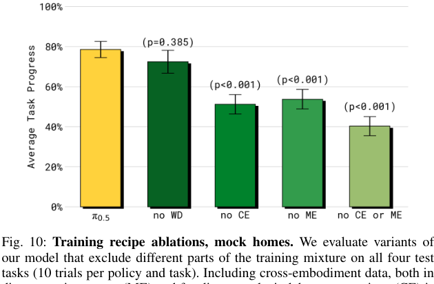

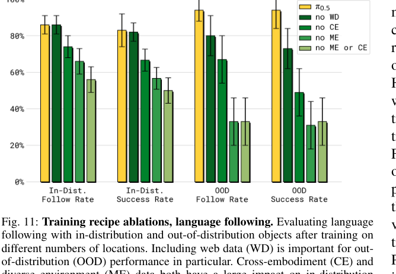

ME 和 CE 对 end-to-end 任务成功率影响最大，说明其他机器人和其他环境中的操作数据确实能迁移到目标移动机器人。WD Web 数据在整体 mock home 指标中不总是显著，但在 OOD 物体语言跟随和高层语义推理中更关键。

### 与 π0 对比

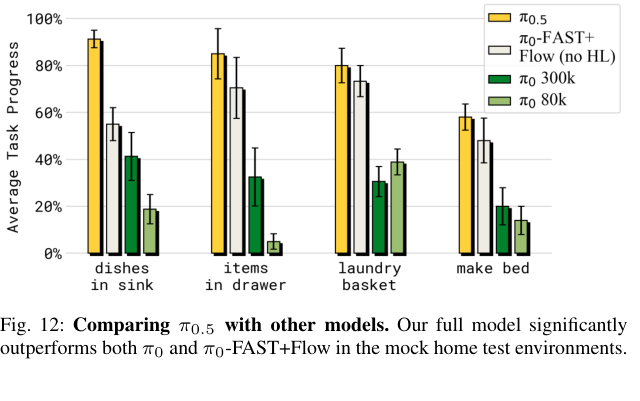

π0.5 明显优于 π0 和 π0-FAST+Flow。这个结果说明提升不只是来自 FAST token 或 flow action expert，而是来自“高层语义监督 + Web 语义数据 + 跨 embodiment 数据 + 两阶段训练”的整体组合。

### 高层推理消融

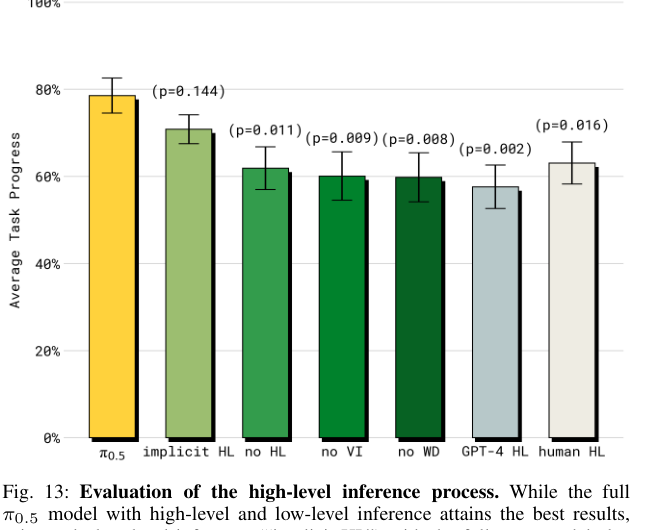

full π0.5 最好；`implicit HL` 训练时使用高层子任务数据但推理时不显式生成子任务，结果第二；`no HL` 明显变差。这说明高层子任务数据本身会改善模型内部的任务结构理解。GPT-4 做 zero-shot 高层策略表现较差，说明通用 VLM/LLM 没有对机器人低层 policy 和动作可达性进行域内适配时，不一定能给出最适合执行的子任务。

## 主要局限

- 数据配方很重，包含真实机器人采集、跨机器人数据、人工子任务标注和语言示范，复现门槛高。
- 真实家庭评测比常规实验更强，但家庭数量和任务类别仍有限。
- 系统没有显式碰撞检测、轨迹规划和失败恢复模块。
- 对陌生抽屉把手、物理交互困难、遮挡、重复高层决策和长时记忆仍不稳。
- 论文没有公开足够工程细节，难以仅凭 PDF 复现完整系统。

## 为什么重要

π0.5 给 VLA 研究的核心启发是：开放世界机器人泛化不能只靠更大的 action head 或更多目标平台轨迹，还需要把语义理解、跨机器人迁移、任务分解和真实部署示范组织成一个统一训练问题。它把 VLA 的竞争点从“模型怎么输出动作”推进到“模型从哪些监督中学会泛化”。
